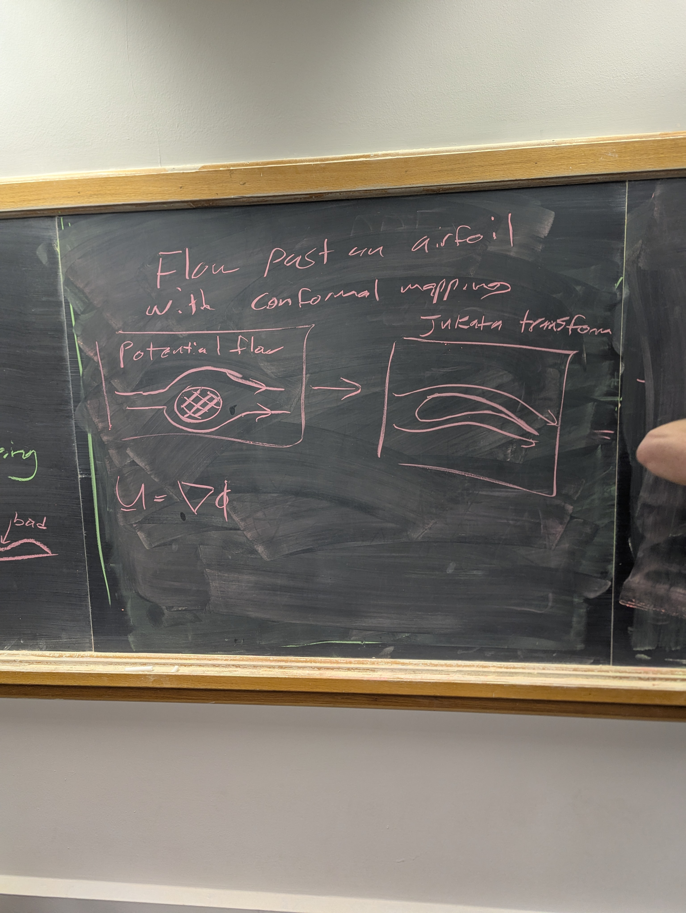

# Applied Math #1 Final Project

Daniel Krawciw

## 11/04/2025

Dr. Brennan Sprinkle gave me the direction to explore flow past an airfoil with conformal mapping using the Joukowsky transformation.

